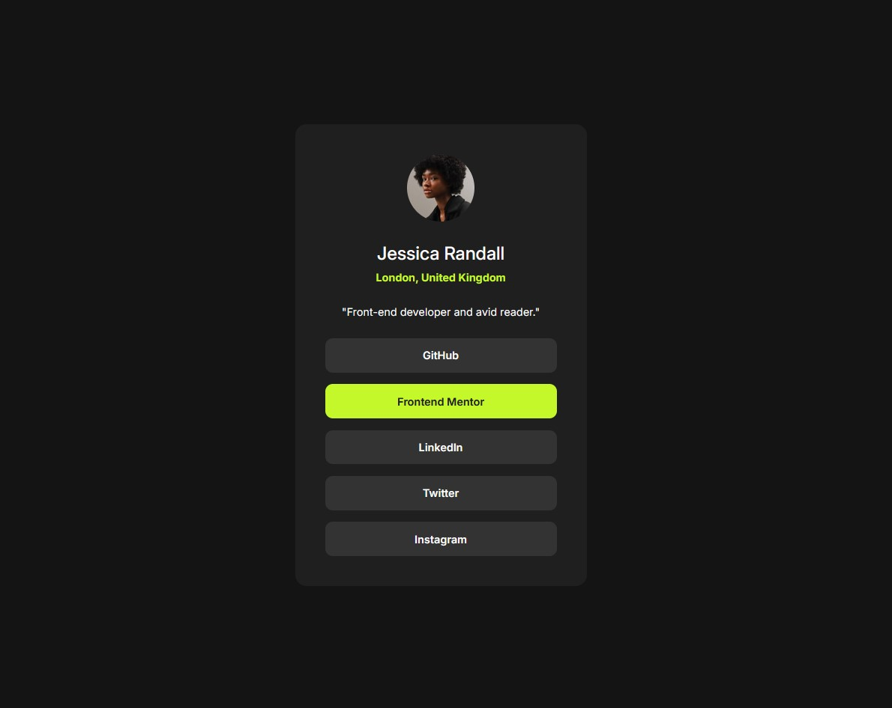

# Frontend Mentor - Social links profile solution

This is a solution to the [Social links profile challenge on Frontend Mentor](https://www.frontendmentor.io/challenges/social-links-profile-UG32l9m6dQ). Frontend Mentor challenges help you improve your coding skills by building realistic projects. 

## Table of contents

- [Overview](#overview)
  - [The challenge](#the-challenge)
  - [Screenshot](#screenshot)
  - [Links](#links)
- [My process](#my-process)
  - [Built with](#built-with)
  - [What I learned](#what-i-learned)
- [Author](#author)
- [Acknowledgments](#acknowledgments)

## Overview

### The challenge

Users should be able to:

- See hover and focus states for all interactive elements on the page

### Screenshot

### Links

- Solution URL: [https://github.com/ivan-develops/social-links-profile](https://github.com/ivan-develops/social-links-profile)
- Live Site URL: [https://ivan-develops.github.io/social-links-profile/](https://ivan-develops.github.io/social-links-profile/)

## My process

### Built with

- Semantic HTML5 markup
- CSS custom properties
- Flexbox
- CSS Grid

### What I learned

I have learned nesting in CSS and how to use the `:hover` pseudo-class to interact.

## Author

- Website - [https://github.com/ivan-develops](https://github.com/ivan-develops)
- Frontend Mentor - [@IvanInterfaceDeveloper](https://www.frontendmentor.io/profile/IvanInterfaceDeveloper)